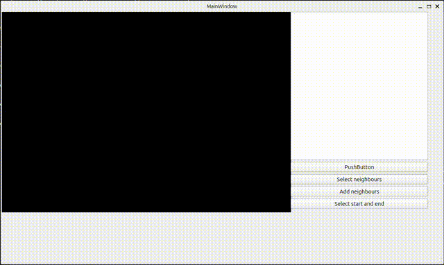
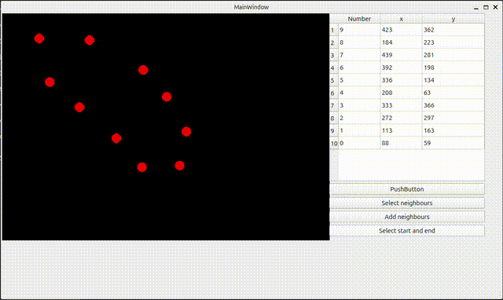
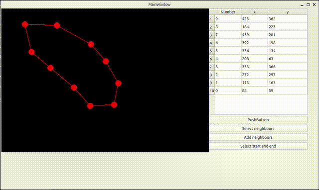

# Navigator

## The project was created to visualise the shortest path search algorithm (Dijkstra's Algorithm) on the plane

# Opportunities
-building a path with any connection logic.

-logging of point coordinates.

-construction of the shortest path between two points.

# Utilisation

### Path construction
1. Placement of points

2. Choosing neighbours

3. Path searching

